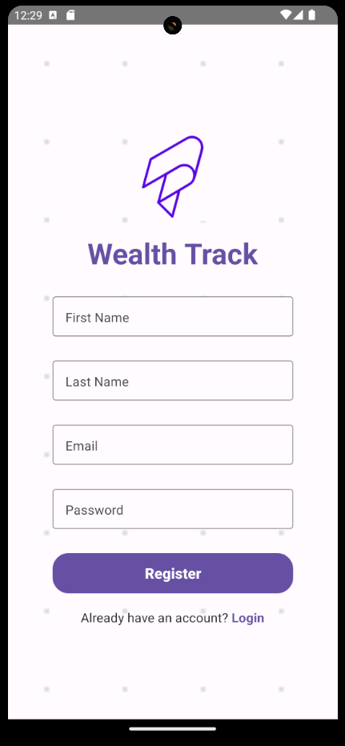
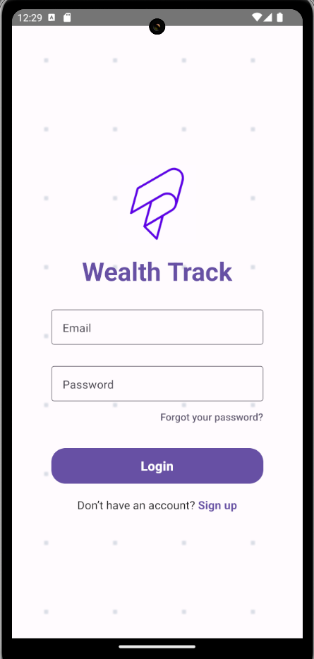
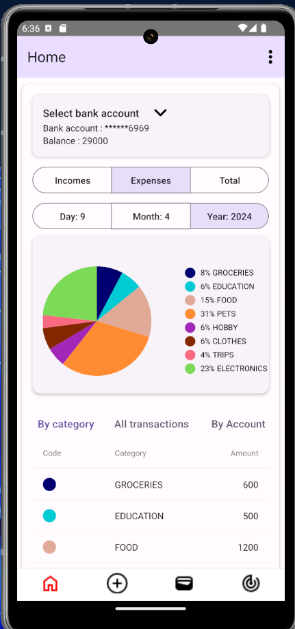
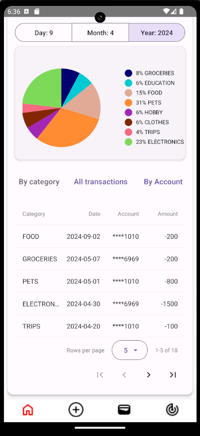
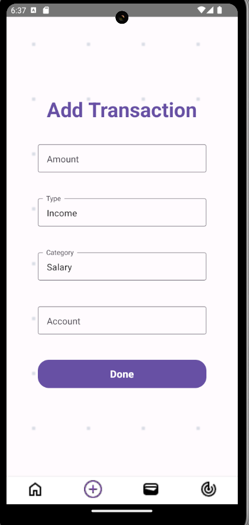
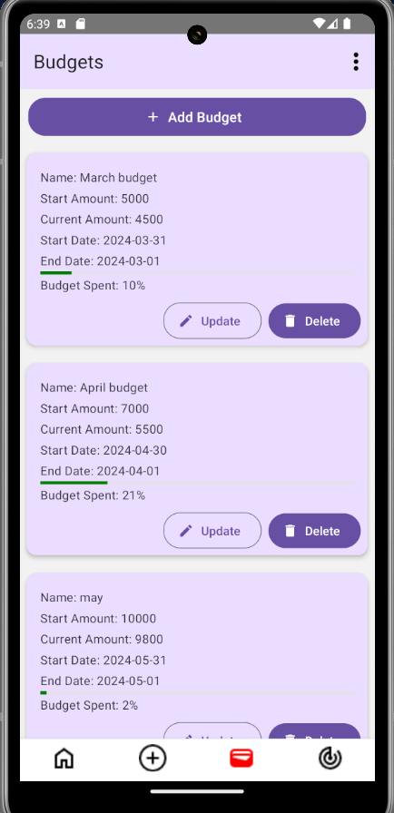
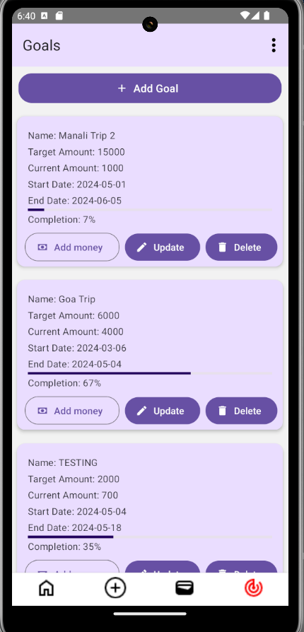
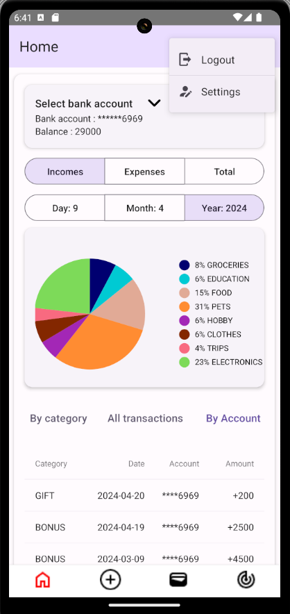
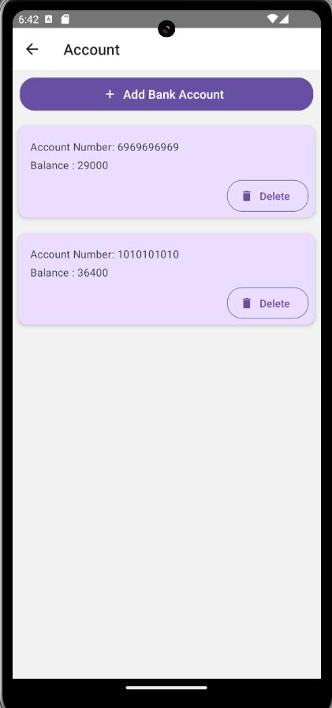

This is a new [**React Native**](https://reactnative.dev) project, bootstrapped using [`@react-native-community/cli`](https://github.com/react-native-community/cli).

Components are used from [**React Native Paper**](https://reactnativepaper.com/) project

# Getting Started

## Step 1: Install dependencies
To install dependencies, run the following command from the _root_ of the project:
```bash
npm install
```

## Step 2: Start the Metro Server

To start Metro, run the following command from the _root_ of your React Native project:

```bash
npm start
```

## Step 3: Start your Application

Let Metro Bundler run in its _own_ terminal. Open a _new_ terminal from the _root_ of your React Native project. Run the following command to start your _Android_ or _iOS_ app:

### For Android

```bash
npm run android
```

### For iOS

```bash
npm run ios
```

NOTE: If using physical device, enable usb debugging before hand and see if device appears on running "adb devices" command.

If using emulator keep your emulator running before trying to
run the application to avoid errors. 


## API

The repository of the API used in this project can be found [here](https://github.com/edgarAndrew/personal-finance-tracker-API)

If you have setup the API locally, then to use it make changes in src/axios.ts

```
axios.defaults.baseURL = "http://<your wifi IP>:8080/api/v1";
```

## Screenshots










